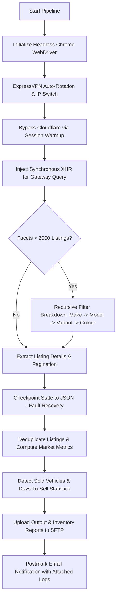

# 🚘 AutoTrader UK Market Data ETL Pipeline

[](https://www.python.org/)
[](https://www.selenium.dev/)
[](https://pandas.pydata.org/)
[](#)

An enterprise-grade, resilient data extraction and ETL pipeline built with Python and Selenium to scrape, clean, deduplicate, and analyze car listings from AutoTrader UK.

---

## 🏗️ Architecture & Core Features


---

## Key Engineering Capabilities
- 🛡️ Anti-Bot & Cloudflare Bypass: Executes headless browser sessions and injects synchronous JavaScript XMLHttpRequest (XHR) directly into the browser execution context.  
- 🔄 Automated VPN Rotation: Integrates shell-based ExpressVPN script execution to rotate IPs automatically on connection failures or rate limits.  
- 🌲 Dynamic Facet Partitioning: Handles AutoTrader API page limits by dynamically splitting query payloads down to Make -> Model -> Variant -> Colour when result thresholds exceed 2,000 items.  
- 💾 Crash-Safe Checkpointing: Progress is continuously written to state JSON files, allowing execution recovery from exact interruption nodes.  
- 📊 Market Intelligence Analytics: Tracks vehicle listing lifespans, missing days counts, sold statuses, and platform inventory metrics over time.  
- 📤 Enterprise Delivery & Alerts: Automatically uploads datasets to remote SFTP servers and dispatches operational logs via Postmark API.

---

## 🛠️ Tech Stack
- Core Language: Python 3.9+  
- Automation & Scraping: Selenium WebDriver, ChromeDriverManager  
- Data Manipulation & ETL: Pandas, NumPy, JSON, Openpyxl, CSV/Excel  
- Network & Infrastructure: Paramiko (SFTP), Postmarker API, ExpressVPN CLI Integration

---

## ⚙️ Configuration & Setup
#### 1. Prerequisites
   - Python 3.9 or higher installed
   - Google Chrome browser & ChromeDriver matching your version
   - ExpressVPN Linux CLI (if automated VPN rotation is required)
     
#### 2. Installation
Clone the repository and install required packages:

```Bash
git clone [https://github.com/nivethamanoharan/autotrader-market-data-pipeline.git](https://github.com/nivethamanoharan/autotrader-market-data-pipeline.git)
cd autotrader-market-data-pipeline
pip install -r requirements.txt
```

#### 3. Environment Variables
Create a .env file in the root directory:

```Code snippet
SFTP_DOWNLOAD_HOST=sftp.example.com
SFTP_DOWNLOAD_USERNAME=your_username
SFTP_DOWNLOAD_PASSWORD=your_password
SFTP_DOWNLOAD_PORT=22
SFTP_DOWNLOAD_PATH=/remote/market_data/
```

---

## 🚀 Running the Pipeline
To execute the market extraction and data synchronization pipeline:

```Bash
python VPN_AUTOTRADER.py
```

---

## 📊 Sample Output Schema

| Field Name | Type | Descriptions | 
|------------|------|--------------|
| Scrape_date | String |Date of pipeline execution (YYYY-MM-DD)  
| vehicle_id | String | Unique AutoTrader vehicle listing identifier |  
| date_first_posted | String | Derived listing publish date |  
| make / model | String | Vehicle manufacturer and model designation |  
| price | String | Advertised vehicle price |  
| days_to_sell | Integer | Estimated market lead time upon listing removal |
| hasDigitalRetailing | Boolean | Reserve-online status indicator |

---

## 📧 Author & Connect
#### Nivetha Manoharan
> Software Developer (Data Engineering & Automation)
- 💼 LinkedIn: linkedin.com/in/nivethamanoharan  
- ✉️ Email: nivemanoharan2001@gmail.com  
- 📍 Status: Open to relocation to UAE | Immediate Availability  
